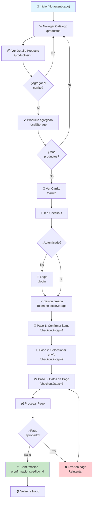
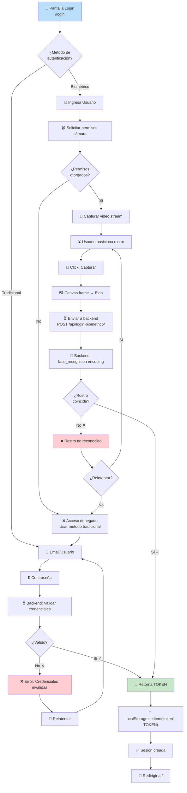
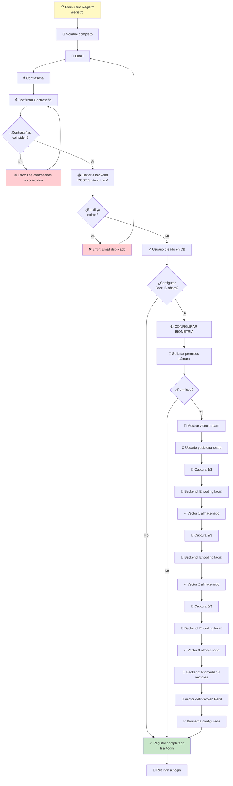
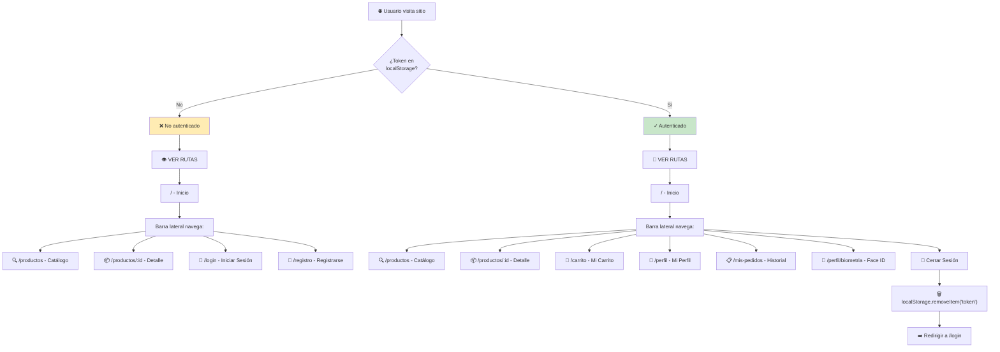
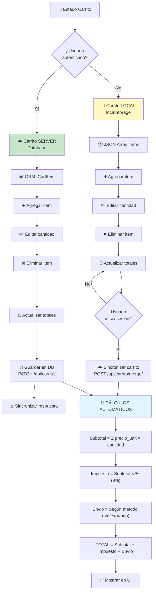
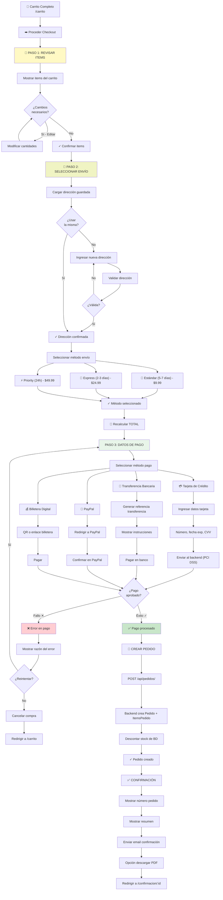
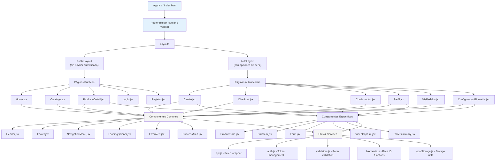
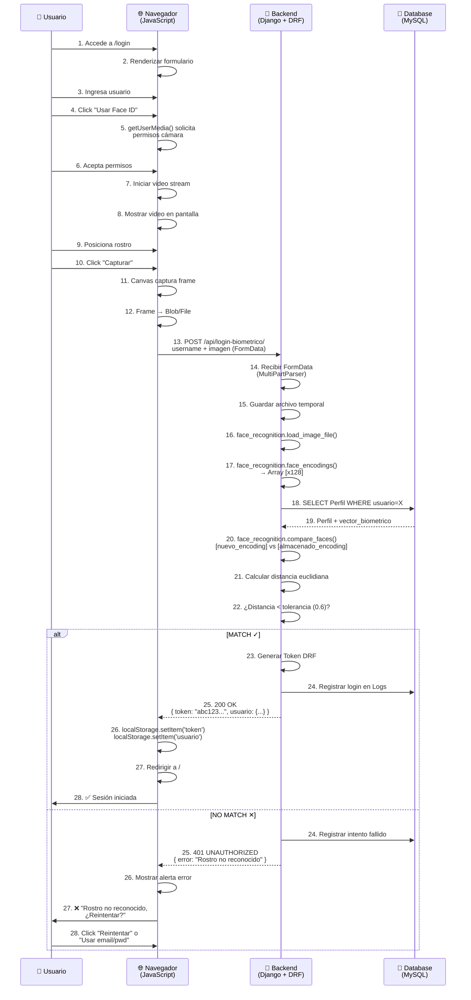

# 🎭 FunkoMon — Diagramas de Flujo (Semana 1)

## 1. FLUJO COMPLETO DE COMPRA

---

## 2. FLUJO DE AUTENTICACIÓN (LOGIN)

---

## 3. FLUJO DE REGISTRO + BIOMETRÍA

---

## 4. FLUJO DE NAVEGACIÓN SEGÚN AUTENTICACIÓN

---

## 5. FLUJO DE CARRITO (Operaciones)

---

## 6. FLUJO DE CHECKOUT (3 PASOS)

---

## 7. ESTRUCTURA COMPONENTES FRONTEND

---

## 8. CICLO DE VIDA: LOGIN BIOMÉTRICO

---

## 9. MATRIZ DE RESPONSABILIDADES: FRONTEND vs BACKEND

| Tarea | Frontend | Backend | Compartido |
|-------|----------|---------|-----------|
| **Autenticación Tradicional** | Formulario, validación client | Validar credenciales, generar token | ✓ Token |
| **Autenticación Biométrica** | Captura video, canvas, envio imagen | face_recognition, encoding, comparación | ✓ Imagen |
| **Registro** | Formulario, validación client | Crear usuario, hashear pwd | ✓ Datos |
| **Captura Biométrica** | getUserMedia, canvas, upload | Encoding, almacenar vector | ✓ Vector |
| **Listado Productos** | UI grid, filtros client | Consultar DB, aplicar filtros DB | ✓ Filtros |
| **Detalle Producto** | Mostrar info, reviews | Consultar DB | ✓ API |
| **Carrito** | Mostrar items, UI edición | CRUD en DB (si autenticado) | ✓ Sincronización |
| **Checkout** | Formulario, cálculos UI | Crear pedido, descontar stock | ✓ Datos |
| **Pago** | Formulario tarjeta (opcional) | Procesar pago (gateway externo) | ✓ Seguridad |
| **Confirmación** | Mostrar comprobante | Generar PDF, enviar email | ✓ Datos |

---

## 10. CHECKLIST DE FUNCIONALIDADES (SEMANA 1)

### Pantalla: HOME
- [ ] Banner principal con CTA (Call To Action)
- [ ] Categorías destacadas (mini cards)
- [ ] Productos destacados (grid 4 productos)
- [ ] Footer con links
- [ ] Responsive mobile/tablet/desktop

### Pantalla: CATÁLOGO
- [ ] Listado paginado de productos (12 por página)
- [ ] Grid responsive (1 col mobile, 2 tablet, 3+ desktop)
- [ ] Filtros (categoría, precio, rating)
- [ ] Ordenamiento (precio, nombre, rating)
- [ ] Búsqueda en tiempo real
- [ ] Cards con imagen, precio, rating

### Pantalla: DETALLE PRODUCTO
- [ ] Galería de imágenes con miniaturas
- [ ] Información producto (precio, stock, rating)
- [ ] Descripción larga
- [ ] Selector cantidad
- [ ] Botón "Agregar al Carrito"
- [ ] Reviews/opiniones
- [ ] Productos relacionados (cross-sell)

### Pantalla: LOGIN
- [ ] Formulario email + password
- [ ] Validación campos
- [ ] "Mostrar/ocultar contraseña"
- [ ] Recordar usuario (checkbox)
- [ ] Link "¿Olvidaste tu contraseña?"
- [ ] Integración API `/api/token/`
- [ ] Manejo errores (401, 400)
- [ ] **[NEW]** Opción Face ID
  - [ ] Acceso a cámara
  - [ ] Video stream
  - [ ] Canvas captura
  - [ ] Envío imagen
  - [ ] Manejo respuesta

### Pantalla: REGISTRO
- [ ] Formulario (nombre, email, pwd)
- [ ] Validación campos
- [ ] Confirmación contraseña
- [ ] Link login
- [ ] Integración API `/api/usuarios/`
- [ ] Manejo errores
- [ ] **[NEW]** Opción captura biométrica
  - [ ] Video stream
  - [ ] 3 capturas
  - [ ] Envío a backend
  - [ ] Manejo respuesta

### Header/Navigation
- [ ] Logo
- [ ] Buscador (UI básica, sin funcionalidad aún)
- [ ] Iconos: 👤 Perfil, 🛒 Carrito, ☰ Menú
- [ ] Menú hamburguesa (mobile)
- [ ] Dropdown menú perfil (si autenticado)
- [ ] Hover effects

### Estado Sesión
- [ ] Token almacenado en localStorage
- [ ] Redirecciones condicionales
- [ ] Cierre de sesión
- [ ] Persistencia al recargar

---

**Próximas semanas:**
- Semana 2: Carrito + Checkout
- Semana 3: Pedidos + Perfil + Face ID avanzado
- Semana 4: Pulido, testing, optimización
